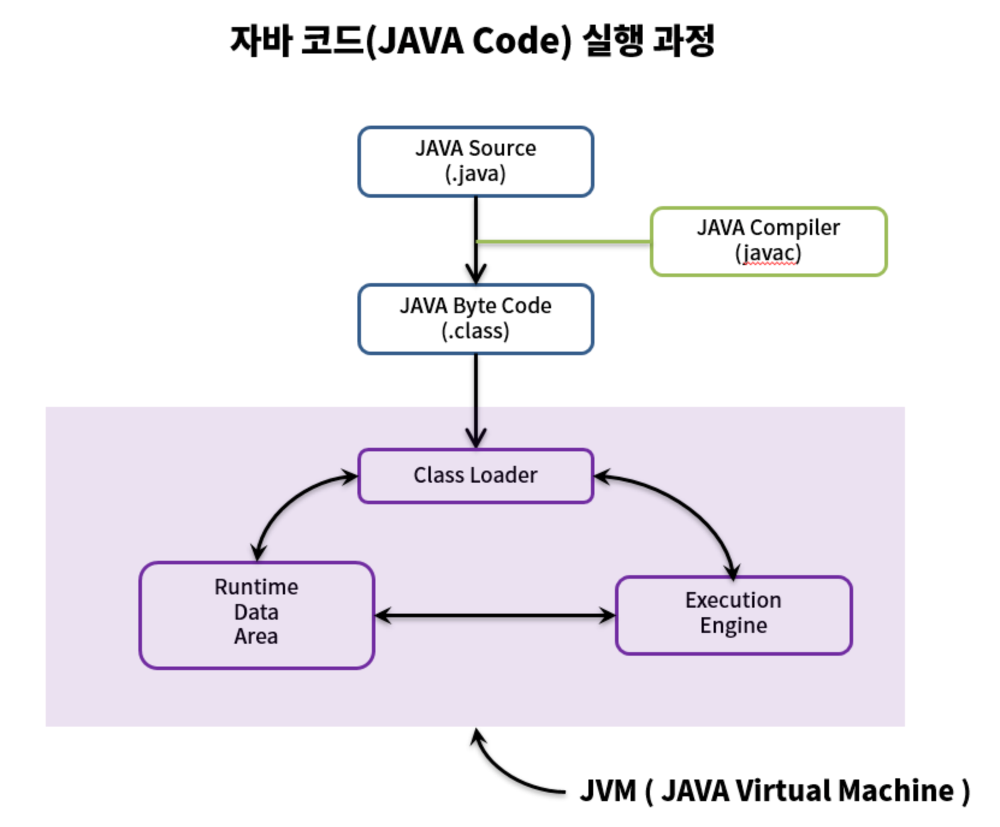

# JVM

## 목차
- [JVM(Java Virtual Machine 이란?)](#jvmjava-virtual-machine-이란-)  
- [자바코드 컴파일 과정](#자바코드-컴파일-과정)  
- [JVM 주요 역할](#jvm-주요-역할)  

## JVM(Java Virtual Machine) 이란 ? 
- 자바 프로그램을 실행시키기 위한 가상의 컴퓨터으로 바이트코드를 읽고 운영체제에 맞게 해석하고 실행해주는 역할이다. 

## 자바코드 컴파일 과정 

JVM 외부
- **Java Source(.java)**: 사람이 읽을 수 있는 소스코드 
- **Java Compiler(javac)**: .java 파일을 읽어서 바이트코드(.class)로 변환
- **Java ByteCode(.class)**: .class 파일은 컴파일된 자바 코드로, 운영체제와는 독립적이다. 
----
JVM 내부
- **Class Loader**: JVM 이 .class 파일을 메모리에 불러오는 과정
- **Runtime Data Area**: 자바 프로그램이 실행되면서 JVM 내부에서 사용하는 여러 종류의 메모리 공간들의 집합
- **Execution Engine**: 바이트코드를 인터프리트하거나 JIT 컴파일해서 실행 

## JVM 주요 역할
- **바이트코드 실행**: 컴파일된 .class 파일을 해석해서 실행
- **메모리 관리**: 자동으로 힙/스택 메모리 할당 및 가비지 컬렉션 수행
- **보안 관리**: 클래스 로딩 및 실행 과정에서 보안 체크 수행 
